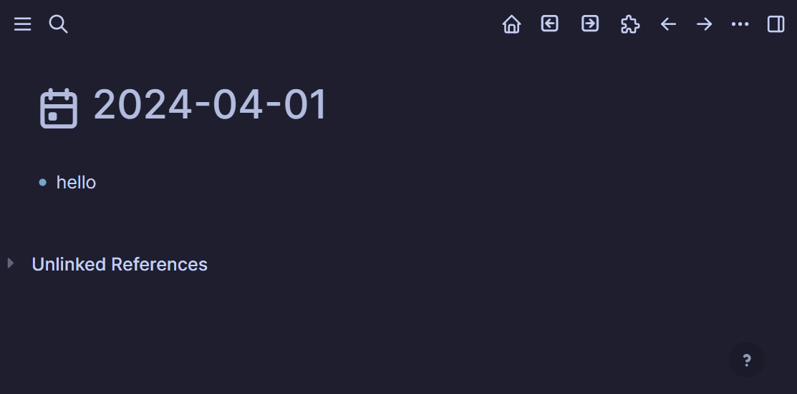

## Logseq journals next/prev

A plugin that provides a "next" and "previous" button to the toolbar to switch to the next or previous journal entry that already exists. 
Dates that do not already have a journal page are skipped, by design. 

### Installation

It is recommended that you use the built-in Logseq plugin marketplace.

1. Push the "..." menu in the top-right of an open Logseq window
2. Click Plugins
3. Click Marketplace
4. Search for "Journals Next/Prev"
5. Click Install

Once the plugin is installed, you will have to manually enable the toolbar buttons. 

1. Press the puzzle piece icon on the Logseq toolbar, near the top right of an open Logseq window
2. Find and "pin" "open-a-next-day" and "open-d-next-day" to enable them in your toolbar.

The naming of the toolbar buttons was designed to put them on either side of the "open-calendar" button from the [Journals calendar plugin by xyhp915](https://github.com/xyhp915/logseq-journals-calendar). Toolbar buttons are arranged alphabetically. 

### Demo

### Licence

MIT
